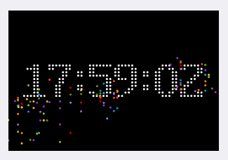
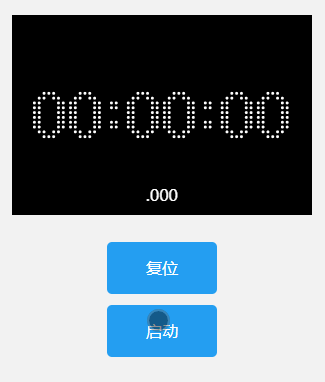
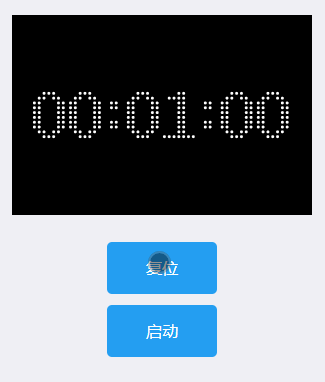

# TimeCanvas
一个在画布上绘制时间的小工具，效果如下：



+ 可以运行在微信小程序
+ 支持IE9+
+ 支持AMD/CommonJS/CMD规范
+ 支持倒计时、计时器、时间
+ 高度可配置


## 一、安装


### 1. 下载包

[点击这里下载](https://github.com/prianyu/time-canvas/archive/refs/heads/main.zip)并引用对应的脚本文件:

### 2. 使用


#### 使用script引入
```html
<script src="/dist/time.min.js"></script>
<!-- or -->
<script src="/dist/time.js"></script>
```

#### 使用require

```javascript
require(['./dist/time.js'], function(TimeCavas) {
  var time = new TimeCavas('canvas')
})
```
#### 使用import

```javascript
import TimeCanvas from './dist/time'

const time = new TimeCanvas("canvas")
time.pause()
```
dist目录下的文件列表和说明如下：

+ **time.js**：仅包含时间的包，引用此包仅可渲染时钟，无法用于倒计时和计数器
+ **time.min.js**：`time.js`的压缩版本
+ **time.all.js**：包含了所有功能的包
+ **time.all.min.js**：`time.all.js`的压缩版本
+ **minprogram目录**：用于微信小程序的所有文件，文件列表同上


> 注意：当画布类型为时钟时实例化后会自动进入时钟渲染状态，当类型为计时或者倒计时时，需要根据自己的需求在合适的时间显示调用play方法进入计时状态。

## 二、API

### 1. 构造函数

`new TimeCanvas(id, options)`

```javascript
var time = new TimeCanvas('time', {
	color: "#FFF",
	colors: ['red', 'blue', '#249ff1']
});

```
**id**
画布的id，默认为canvas

**options**

+ （1）以下为所有的版本均支持的配置：

|字段|类型|是否必须|默认值|说明|
|----|----|-----|------|----|
|colors|Array&lt;color&gt;|是|12个颜色组成的数组|粒子的原色列表，至少应指定一个颜色|
|color|String&lt;color&gt;|否|#0081FF|字体的颜色|
|width|Number|是|320|画布宽度，单位px|
|height|Number|是|200|画布高度，单位px|
|center|Boolean|否|true|内容是否水平居中|
|middle|Boolean|否|true|内容是否垂直居中|
|padding|Number|否|20|画布的内边距，单位px|
|size|Number|否|0|文字的大小，当大小为0时将根据画布可用大小自动适配|
|ballCount|Number|否|300|留在画布上的最大的粒子数量|
|format|String|否|h:i:s|时间的内容的格式，可选值为h:i:s,h:i,i:s,s|

+ （2）以下为完整版额外的配置

|字段|类型|是否必须|默认值|说明|
|----|----|-----|------|----|
|type|String|是|time|指定的时间类型，可选值为：time（时间），count（计时器），countdown（倒计时）|
|endTime|Number|是|Infinity,60|倒计时或者计时的总时间，单位秒，当为count时，默认为无穷大，当为countdown时默认为60秒|
|autoConvert|Boolean|否|true|当定义的时间格式(format)计数超过当前进制时，<br>是否开启格式自动转化，如type为`count`，format为`i:s`，<br>当计数至59:59时，如果autoConvert为true，下一个计数为01:00:00，否则为60:00|

### 2. 实例方法

+ **pause(reserve)**：停止时间渲染，当reserve为true时画布上将保留此刻所有的元素并停止，当为false时，画布上的粒子将继续运动至画布以外，仅保留时间
+ **play(state)**：开始时间渲染，state仅在type为count和countdown时有效，state各种值的用法如下：

	- 0：清空当前计时状态重新计时
	- 1：保留已经计时的状态，并以此刻开始，继续之前的计时，如停止时已计时5s，再计时时会从第6s开始
	- 其他：保留已经计时的状态，并且接下来的计时均以第一次启动的时间作为参考继续计时，如计时5s后停止，再过5s后执行play方法，下一秒计时将是11s
+ **getCurrentTime**：获取当前的计时状态或者时间，返回值为一个对象，对象内容将根据format和type返回不同的内容，具体如下：
  - hours: 按照type为time、count、countdown分别为当前时间的时、已计时的小时数、倒计时剩余的小时数
  - minutes： 按照type为time、count、countdown分别为当前时间的分、已计时的分钟数、倒计时剩余的分钟数
  - seconds：按照type为time、count、countdown分别为当前时间的秒、已计时的秒数、倒计时剩余的秒数
  - milliseconds：按照type为time、count、countdown分别为当前时间的毫秒、已计时的毫秒数、倒计时剩余的毫秒数
  - now：系统当前时间，类型为Date
+ **destroy**：销毁当前实例，销毁后画布将被清空
+ **reset**：重置实例，仅在type为count和countdown有效，重置后回到初始状态


### 

## Demos

所有demo（含小程序和Web）均在[demos目录下](https://github.com/prianyu/time-canvas/tree/main/demos)


以下为小程序下实现的几种效果：





你也可以通过扫描以下二维码体验


